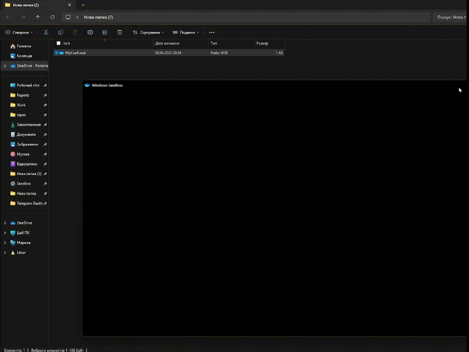

# Windows Sandbox Setup and Automation

This repository provides an easy way to configure and automate the installation of applications within Windows Sandbox. Using simple PowerShell scripts, the setup can automatically install software as soon as Windows Sandbox starts.

## Requirements

- **Windows 10 Pro or Enterprise** (version 1903 or higher) with **Windows Sandbox** feature enabled.
- Basic knowledge of how to use Windows PowerShell.
- Software installers (e.g., `.exe`, `.msi`) for the applications you want to install within the Sandbox.

## Features

- Pre-configured setup for **Windows Sandbox**.
- Automatically installs applications (like VSCode, 7-Zip, etc.) using PowerShell.
- PowerShell window is visible during execution.
- Configurable folder mappings for easy access to files from the host system.

## Installation Guide

### 1. Enable Windows Sandbox

For detailed instructions on enabling **Windows Sandbox**, refer to the official Microsoft documentation:

[Enable Windows Sandbox](https://docs.microsoft.com/en-us/windows/security/threat-protection/windows-sandbox/windows-sandbox-overview)

### 2. Create `SandboxConf.wsb` File

Create a file named `SandboxConf.wsb` on your local machine and add the following configuration:

    
    <Configuration>
      <VGpu>Default</VGpu>
      <Networking>Default</Networking>
      <MappedFolders>
        <MappedFolder>
          <HostFolder>D:\Sandbox</HostFolder>
          <ReadOnly>true</ReadOnly>
        </MappedFolder>
      </MappedFolders>
      <LogonCommand>
        <Command>cmd.exe /c start powershell.exe -ExecutionPolicy RemoteSigned -File C:\users\WDAGUtilityAccount\Desktop\Sandbox\Installer.ps1</Command>
      </LogonCommand>
    </Configuration>

This configuration will:

-   Map the `D:\Sandbox` folder on the host machine to the Windows Sandbox. (You can change this to any other folder)
    
-   Automatically run the `Installer.ps1` script located at `C:\users\WDAGUtilityAccount\Desktop\Sandbox\Installer.ps1` upon Sandbox startup.
    
-   Use PowerShell with a `RemoteSigned` execution policy.

### 3. Create `Installer.ps1` Script

Create a new file named `Installer.ps1` and add the following PowerShell script code to it. This script will automatically detect `.exe` and `.msi` installers in the `C:\Users\WDAGUtilityAccount\Desktop\Sandbox` folder and execute them silently.

#### PowerShell Script Code:

    
    $installerPath = "C:\Users\WDAGUtilityAccount\Desktop\Sandbox"
    $exeInstallers = Get-ChildItem -Path $installerPath -Filter *.exe -File -Recurse
    $msiInstallers = Get-ChildItem -Path $installerPath -Filter *.msi -File -Recurse
    
    # Combine two installer lists
    $installers = @()
    $installers += $exeInstallers
    $installers += $msiInstallers
    
    if ($installers.Count -eq 0) {
        Write-Host "❌ No installers found in $installerPath" -ForegroundColor Red
        exit
    }
    
    Write-Host "🔍 Found $($installers.Count) installer(s):" -ForegroundColor Cyan
    $installers | ForEach-Object { Write-Host "• $($_.Name)" }
    
    Write-Host "`n▶ Installation is starting..." -ForegroundColor Yellow
    
    foreach ($installer in $installers) {
        $ext = $installer.Extension.ToLower()
        $name = $installer.Name
        $fullPath = $installer.FullName
    
        Write-Host "`n➡ Installing $name..." -ForegroundColor White
    
        try {
            if ($ext -eq ".msi") {
                Start-Process -FilePath "msiexec.exe" -ArgumentList "/i `"$fullPath`" /passive /norestart" -Wait -NoNewWindow
            } elseif ($ext -eq ".exe") {
                # Trying the most common silent parameter /S
                Start-Process -FilePath $fullPath -ArgumentList "/S" -Wait -NoNewWindow
            } else {
                Write-Host "⚠ Unknown format: $ext" -ForegroundColor DarkYellow
                continue
            }
    
            Write-Host "✅ Successfully installed: $name" -ForegroundColor Green
        }
        catch {
            Write-Host "❌ Installation failed: $name" -ForegroundColor Red
            Write-Host $_.Exception.Message
        }
    }
    
    Write-Host "`n🏁 Installation completed." -ForegroundColor Cyan

### 4. Place the `Installer.ps1` Script and Required Programs

After creating the `Installer.ps1` file, follow these steps:

1. Place the `Installer.ps1` script you just created in the `D:\Sandbox` folder.
   
2. Add any required programs (e.g., `.exe` or `.msi` installers) that you want to install into the same `D:\Sandbox` folder. These are the applications that will be automatically installed when you start the Windows Sandbox.

Ensure that the installers are placed in the `D:\Sandbox` folder so that the script can find them and perform the installation when the Sandbox is launched.

### 5. Run the `SandboxConf.wsb` 

To start Windows Sandbox with the configured settings and automated installation, simply double-click the `SandboxConf.wsb` file you created in. Windows Sandbox will launch, map the specified folder, and automatically execute the `Installer.ps1` script. You can monitor the installation process in the PowerShell window that will appear.

